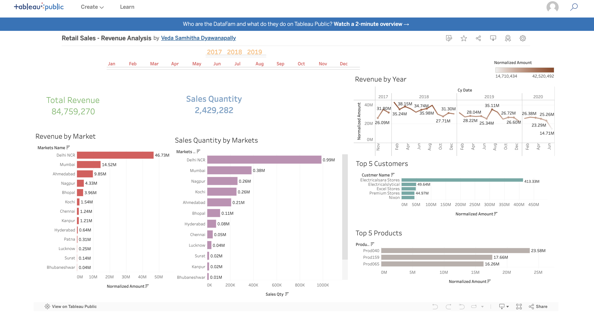

# 🛍️ Sales-Revenue Analysis

## Overview 📊
This repository is dedicated to the analysis of retail revenue analysis, visualized through a Tableau dashboard, The dashboard captures sales trends, revenue generation, and other key performance indicators that are vital for retail business insights.

## Data Visualization 📈
The dashboard sheds light on retail performance with visualizations like:
- 📉 Monthly Sales Trends
- 💵 Revenue by Markets
- 🏪 Sales Quantity by Markets

## Interactive Components 🔧
The dashboard is interactive, allowing users to drill down into:
- 📅 Time periods
- 📍 Geographic regions
- 🏷️ Product categories

## Key Findings 🔑
- Insights into the best-selling products and their revenue contribution.
- Analysis of peak sales periods throughout the year.
- Comparison of store efficiencies based on revenue.

## Screenshot 📸

## Tableau Public Link 🔗
Explore the interactive dashboard on Tableau Public at this link:
[Tableau Retail Sales-Revenue Analysis Dashboard](https://public.tableau.com/app/profile/veda.samhitha.dyawanapally/viz/RetailSales-RevenueAnalysis/Dashboard1)
## Acknowledgements 💡
- Thanks to all the data providers and retailers who made this analysis possible.
- Special appreciation to the customers and staff whose transactions and efforts are reflected in this data.
- Thanks to @Codebasics youtube
